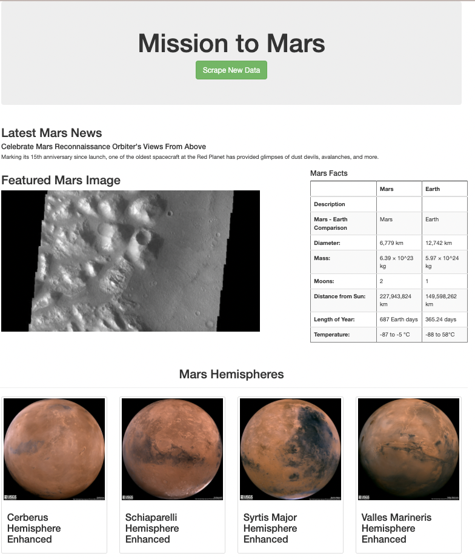

# Mission to Mars - Web Scraping  Challenge 

## Overview of the Analysis 
A junior data scientist, Robin, does freelance astronomy work in her spare time. Her dream is to land a position with NASA someday. So she spends a lot of time visiting sites with news about space exploration, especially the mission to Mars. She wanted to gather data about the mission to Mars from all over the web and display it in a central location by building a web application that will scrape new data every time she tells it to with a click of a button. 

In the initial analysis the web app page was built. Now, she wants to add more polish to it. She had been admiring images of Mars’s hemispheres online and realized that the site is scraping-friendly. She would like to adjust the current web app to include all four of the hemisphere images. 

## Analysis Process

### Scrape Full-Resolution Mars Hemisphere Images and Titles
Used BeautifulSoup and Splinter, to scrape full-resolution images of Mars’ hemispheres and the titles of those images.

To see how this was done, please refer to the [Mission_to_Mars_Challenge](Mission_to_Mars_Challenge.ipynb) file. 

### Updated the Web App with Mars’s Hemisphere Images and Titles
Used Python and HTML to add the code created above to the scraping.py file, updated the Mongo database, and modified the index.html file so the webpage contains all the information collected as well as the full-resolution images and titles for each hemisphere image.

To see how this was done, please refer to the following files:
* [Mission_to_Mars_Challenge](Mission_to_Mars_Challenge.py)
* [scraping](scraping.py)
* [index][templates/index.html]
* [app](app.py)

### Added Bootstrap 3 Components 
Updated the web app to make it mobile-responsive, and added two additional Bootstrap 3 components to make it stand out.

The two additional Boostrap components include:
* Styled the Scrape Button 
* Added the hemisphere images as thumbnails

For more information on how this was done, see [index][templates/index.html]

## Results 
Please see below for a screenshot of the current web app. 

